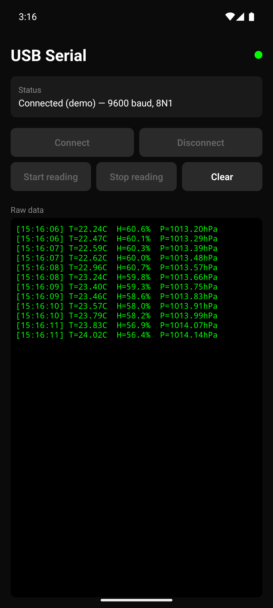

# react-native-usb-serial-android

> USB Serial communication for React Native on Android. Correct permission handling for Android 12, 13, 14+. Clean React hook API. No iOS — read the [FAQ](#faq) for why.

[](https://www.npmjs.com/package/react-native-usb-serial-android)
[](./LICENSE)

---

<p align="center">
  
</p>

> Example app, release build on a Pixel 8 emulator. The example ships with a **demo mode** (no hardware required) that streams simulated sensor readings through the exact same `DeviceEventEmitter` path real USB-serial bytes flow through — so you can verify the UI works before plugging in a device.

## Why this library?

Most existing React Native USB-serial libraries on npm were written before Android 12 and still ship `PendingIntent` flags that crash on modern Android. This library was extracted from a production app talking to a real hardware tester over USB-OTG, and ships:

- **Modern Android permission flow** — uses `FLAG_MUTABLE` on Android 12+ (API 31+), the correct way to request USB permission today.
- **Binary-safe data decoding** — `ISO-8859-1` 1-to-1 byte→char mapping, no UTF-8 replacement characters mangling your serial stream.
- **Auto-detect device unplug** — listens for `ACTION_USB_DEVICE_DETACHED` and emits a `connected: false` event so your UI stays in sync.
- **Tiny, focused API** — `connect`, `disconnect`, `startReading`, `stopReading`, four events. Nothing else.
- **First-class React hook** — `useUsbSerial({ onData })` and you're done.
- **TypeScript** — typed throughout.

Built on top of the battle-tested [`usb-serial-for-android`](https://github.com/mik3y/usb-serial-for-android) driver collection, which supports FTDI, CDC/ACM, CH340, CP210x, and Prolific chipsets.

## Install

```sh
npm install react-native-usb-serial-android
# or
yarn add react-native-usb-serial-android
```

Then rebuild the Android app:

```sh
cd android && ./gradlew clean
cd .. && npx react-native run-android
```

> **Autolinking is handled automatically.** No manual `MainApplication` editing needed on RN 0.71+.

## Android setup

Add USB-host feature and (recommended) a device filter to your app's `AndroidManifest.xml`:

```xml
<manifest xmlns:android="http://schemas.android.com/apk/res/android">
  <uses-feature android:name="android.hardware.usb.host" />

  <application>
    <activity android:name=".MainActivity">
      <intent-filter>
        <action android:name="android.hardware.usb.action.USB_DEVICE_ATTACHED" />
      </intent-filter>
      <meta-data
        android:name="android.hardware.usb.action.USB_DEVICE_ATTACHED"
        android:resource="@xml/device_filter" />
    </activity>
  </application>
</manifest>
```

And `android/app/src/main/res/xml/device_filter.xml`:

```xml
<?xml version="1.0" encoding="utf-8"?>
<resources>
  <!-- Match any USB serial device. Tighten with vendor-id / product-id for production. -->
  <usb-device />
</resources>
```

## Quick start (React hook)

```tsx
import React, { useState } from 'react';
import { View, Text, Button, ScrollView } from 'react-native';
import { useUsbSerial } from 'react-native-usb-serial-android';

export default function App() {
  const [log, setLog] = useState('');

  const { connected, status, error, connect, disconnect, startReading, stopReading } =
    useUsbSerial({
      onData: (chunk) => setLog((prev) => prev + chunk),
    });

  return (
    <View style={{ flex: 1, padding: 16 }}>
      <Text>Status: {status}</Text>
      <Text>Connected: {connected ? 'yes' : 'no'}</Text>
      {error && <Text style={{ color: 'red' }}>Error: {error}</Text>}

      <Button title="Connect" onPress={() => connect({ baudRate: 9600 })} />
      <Button title="Start reading" onPress={startReading} />
      <Button title="Stop reading" onPress={stopReading} />
      <Button title="Disconnect" onPress={disconnect} />

      <ScrollView style={{ flex: 1, marginTop: 16, backgroundColor: '#111' }}>
        <Text style={{ color: '#0f0', fontFamily: 'monospace' }}>{log}</Text>
      </ScrollView>
    </View>
  );
}
```

## Quick start (imperative)

If you're not using React (e.g. inside a worker, redux saga, or class component):

```ts
import { UsbSerial } from 'react-native-usb-serial-android';

const dataSub = UsbSerial.addListener('data', (chunk) => console.log(chunk));
const errSub = UsbSerial.addListener('error', (msg) => console.error(msg));

await UsbSerial.connect({ baudRate: 115200, dataBits: 8, stopBits: 1 });
UsbSerial.startReading();

// later
UsbSerial.stopReading();
await UsbSerial.disconnect();
dataSub.remove();
errSub.remove();
```

## API

### `useUsbSerial(options?)`

| Returned field | Type | Description |
|---|---|---|
| `connected` | `boolean` | True when an active USB serial port is open. |
| `status` | `string` | Latest human-readable status from the native module. |
| `error` | `string \| null` | Latest error, if any. |
| `connect(opts?)` | `(opts?: ConnectOptions) => Promise<string>` | Open the first detected USB serial device. Requests permission if needed. |
| `disconnect()` | `() => Promise<string>` | Close the port. |
| `startReading()` | `() => void` | Begin emitting `data` events. |
| `stopReading()` | `() => void` | Stop emitting `data` events (port stays open). |

Options:

```ts
type UseUsbSerialOptions = {
  onData?: (chunk: string) => void;
};
```

### `UsbSerial` (imperative)

```ts
UsbSerial.isSupported(): boolean;
UsbSerial.connect(options?: ConnectOptions): Promise<string>;
UsbSerial.disconnect(): Promise<string>;
UsbSerial.startReading(): void;
UsbSerial.stopReading(): void;
UsbSerial.addListener(event, callback): Subscription;
```

### `ConnectOptions`

```ts
type ConnectOptions = {
  baudRate?: number;      // default 9600
  dataBits?: 5 | 6 | 7 | 8;  // default 8
  stopBits?: 1 | 2;       // default 1
  // parity = NONE always (other modes not exposed yet)
};
```

### Events

| Event | Payload | When |
|---|---|---|
| `data` | `string` | Each chunk read from the serial port (ISO-8859-1 decoded). |
| `status` | `string` | Lifecycle messages: connecting, connected, reading, disconnected. |
| `error` | `string` | Connection failure, permission denied, IO errors. |
| `connected` | `boolean` | Hardware connection state. Fires on connect, disconnect, **and unplug**. |

## How it works

This library is a thin React Native bridge over [`usb-serial-for-android`](https://github.com/mik3y/usb-serial-for-android). The native `UsbSerialModule.kt`:

1. On `connect`, enumerates USB devices via `UsbSerialProber`.
2. Requests `USB_PERMISSION` from the user with a properly-flagged `PendingIntent` (`FLAG_MUTABLE | FLAG_UPDATE_CURRENT` on Android 12+).
3. Once granted, opens the port with the requested baud/data/stop bits and starts a background `SerialInputOutputManager` thread.
4. Decodes incoming bytes as ISO-8859-1 (lossless 1:1 byte→char mapping) and emits them to JS via `DeviceEventEmitter`.
5. Listens for `ACTION_USB_DEVICE_DETACHED` to detect hardware unplug and emit `connected: false`.

## FAQ

### Does this support iOS?

No, and it never will via this approach. iOS does not allow third-party apps to talk to arbitrary USB-serial devices over Lightning or USB-C — it requires the device manufacturer to be enrolled in Apple's [MFi (Made for iPhone) program](https://mfi.apple.com/) and to use the External Accessory framework. If you need cross-platform serial communication, your device manufacturer needs MFi certification first; then a separate iOS module talking to the MFi accessory.

### Which USB chipsets are supported?

Whatever [`usb-serial-for-android` 3.x](https://github.com/mik3y/usb-serial-for-android#compatible-devices) supports: FTDI (FT232, FT2232 etc.), CDC/ACM, CH340/CH341, CP210x, Prolific PL2303, and more.

### Why ISO-8859-1 instead of UTF-8?

UTF-8 decoding of arbitrary byte sequences produces `` (U+FFFD) replacement characters for any byte that isn't valid UTF-8. ISO-8859-1 maps every byte 0–255 to a unique character, so you can losslessly round-trip binary data through a JavaScript string and parse it on the JS side.

### My app crashes on Android 12+ when requesting USB permission

That's the bug this library was written to avoid. Make sure you're on the latest version and that no other library in your app is creating immutable `PendingIntent`s for USB permission.

### Can I list devices and pick one?

Not yet — `connect()` picks the first detected device. Multi-device support is on the roadmap; PRs welcome.

### Where's TurboModules / Fabric support?

The library works under the New Architecture via the legacy bridge interop. A native TurboModule version is on the roadmap.

## Roadmap

- [ ] Device enumeration & explicit device selection
- [ ] Parity (EVEN, ODD, MARK, SPACE)
- [ ] `write()` for sending bytes back to the device
- [ ] TurboModule (Fabric) implementation
- [ ] Expo config plugin

## Contributing

Issues and PRs welcome at [github.com/petkarsanathraj/react-native-usb-serial-android](https://github.com/petkarsanathraj/react-native-usb-serial-android).

## License

MIT © Sanath Raj Petkar

---

Built by **Sanath Raj Petkar** — React Native developer specializing in native modules and hardware/IoT integrations. Available for freelance React Native projects. Reach me at [sanathpetkar@gmail.com](mailto:sanathpetkar@gmail.com).
